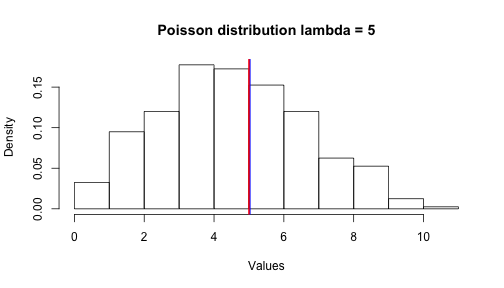
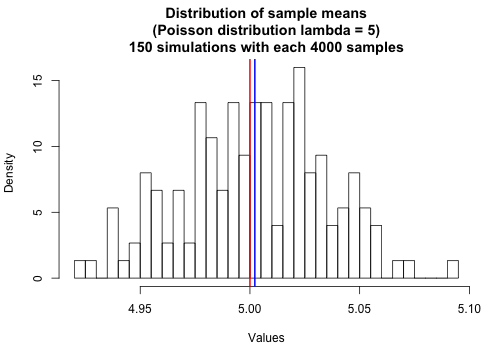

## SUMMARY

This app shows, with 3 different distributions (the normal, the uniform and the Poisson), the distribution of the estimated mean. We want to demonstrate that, whatever the type of distribution, when sampling from the population, the mean of that sample (which is an estimate of the actual mean fo the population) follows a normal distribution centered at the mean and with a standard deviation that decreases with the square root of the standard deviation of the original distribution.

For simplicity, the parameters of these distributions cannot be changed in this app. The following parameters are used:
* For the normal distribution: mean = 0 and Std = 1 (the default settings)
* For the uniform distribution: min = 0 and max = 1 (the default settings)
* For the Poisson distribution: lambda = 5


--- .class #id 

## THE SIDE BAR
The side bar lets the user choose several parameters:

1. the seed (to have repeatable graphs)
2. the type of distribution to be shown
5. the sample size
4. the number of bins for the histogram
5. Whether the population mean and/or the sample mean will be displayed


--- .class #id 

## THE 1st TAB
This tab displays a density histogram of the chosen distribution. Typically it will look like the one below, with, optionally the ablines showing the theoretical mean and sample mean.

```r
distr <- rpois(400, lambda = 5)
hist(distr, xlab = "Values", main = "Poisson distribution lambda = 5", breaks = 12, freq = FALSE)
abline(v = c(mean(distr), 5), col = c("blue", "red"), lwd = 2)
```




--- .class #id 

## THE 2nd TAB
The user can choose the number of simulations to be run. In each simulation, a sample will be taken from the population and its sample mean will be computed. All these sample means will be displayed in this histogram, showing that the distribution of sample mean follows a normal distribution centered at the mean of the original distribution with a standard deviation (called the standard error of the mean) that decreases with the square root of the sample size.



